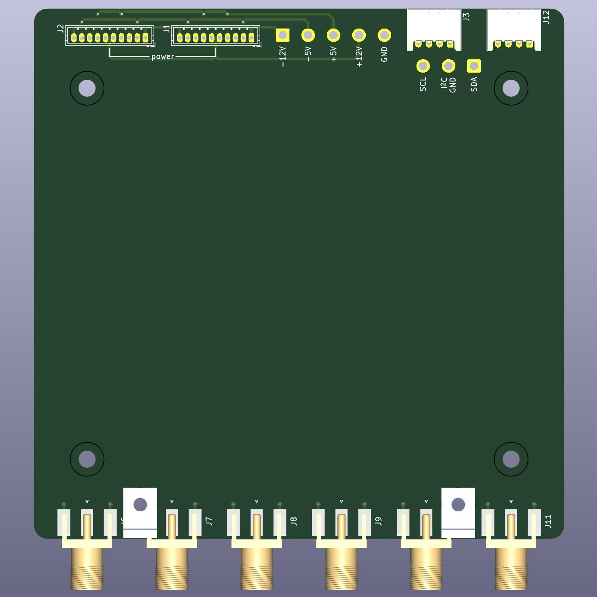

# pcb_kicad_template
KiCAD template for Hammond 1475/Eurocard format

## Features

- 100mm eurocard format, fits inside [Hammond 1457 series enclosures](https://www.hammfg.com/electronics/small-case/extruded/1457-emi).Alternatively place inside a [Schroff 24563131 Eurocard subrack](https://www.digikey.com/en/products/detail/schroff/24563131/4209922) or similar.
- [S10B-ZR-3.4 10-pin JST ZH connector](https://www.digikey.com/en/products/detail/jst-sales-america-inc/S10B-ZR-3-4/9972252) for power connections. Use with the [JST A10ZR10ZR28H51A cable](https://www.digikey.com/en/products/detail/jst-sales-america-inc/A10ZR10ZR28H51A/6708528).
- [S4B-PH-K-S 4-pin connector](https://www.digikey.com/en/products/detail/jst-sales-america-inc/S4B-PH-K-S/926628) for I2C connections. This is compatible with the [Adafruit STEMMA standard](https://learn.adafruit.com/introducing-adafruit-stemma-qt/what-is-stemma). Use with a cable from Adafruit, such as the [ST PH 2mm 4-Pin to Male Header Cable - I2C STEMMA Cable](https://www.digikey.com/en/products/detail/adafruit-industries-llc/3955/9745250) or [STEMMA Cable - 4 Pin JST-PH 2mm Cable-Female/Female](https://www.digikey.com/en/products/detail/adafruit-industries-llc/3568/7672337).
- x6 [Amphenol 132289 SMA connectors](https://www.digikey.com/en/products/detail/amphenol-rf/132289/1989875), remove if unnecessary.